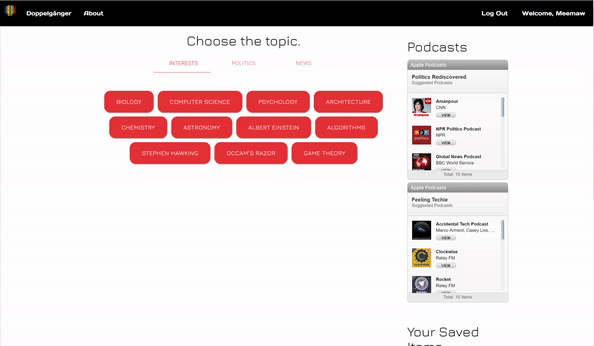
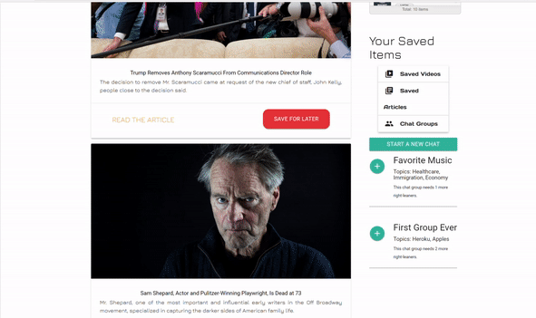
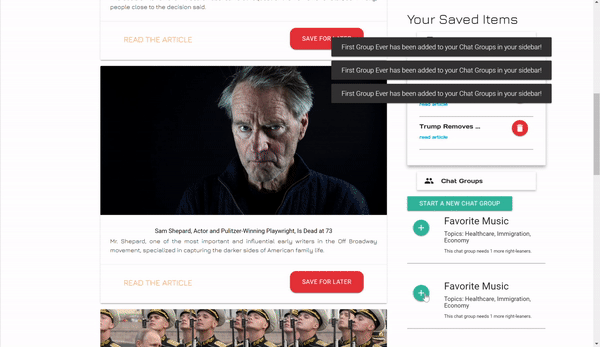
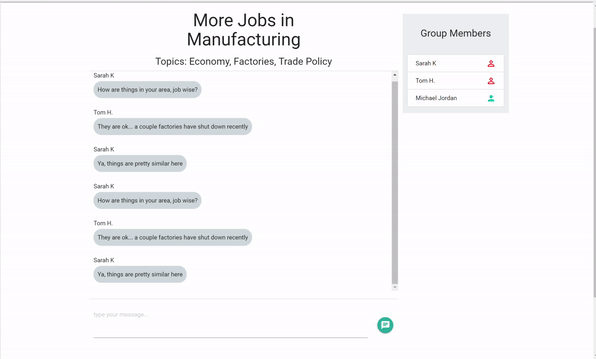

# Doppelgänger
Doppelgänger allows users to create an account and specify two important pieces of information about themselves: their political leaning and their general background (either STEM or humanities). Once they log in, they are provided with resources in both areas that are geared toward the opposite types. Resources provided include: YouTube videos on various topics, Apple podcasts, and news headlines.

The goal of the application is to broaden the users' minds to other perspectives and allow them the opportunity to meet a different side of themselves and the world.

# How It Works

### When a user lands on the homepage, he/she will sign up or log in. 

 ### When the user makes a profile, he/she will select two important things about him/herself: political leaning and interest background.

### When his/her page loads, the user is given options for various topics to search (which queries the YouTube API) that he/she would normally never look at and represent effectively the opposites of their own views and background. The user can watch the videos on that screen or save them for later. 

### The same applies to the News tab. The user is given a variety of news sources that represent opposing views or topics from what he/she would normally seek him/herself.

### When a user wants to save an article or video, he/she may click 'Save for Later' and the article will be saved on the sidebar.

### Doppelganger also features chat groups created using Socket.io. A user can join or add a chat group and chat in real time with other users on various topics.

# Technologies Used

 * JavaScript/jQuery
 * Node.js
 * MongoDB
 * Passport.js
 * YouTube and News APIs
 * AJAX
 * Socket.io
 * MaterializeCSS

# Meet the Developers

* Kristina Karrass
	* [Kristina's GitHub Repo](https://github.com/kristinakarrass)
* Brian Manchester
	* [Brian's GitHub Repo](https://github.com/bmanch)
* Seton Raynor
	* [Seton's GitHub Repo](https://github.com/setonr)
* Candace Toliver
	* [Candace's GitHub Repo](https://github.com/CToliver12)
