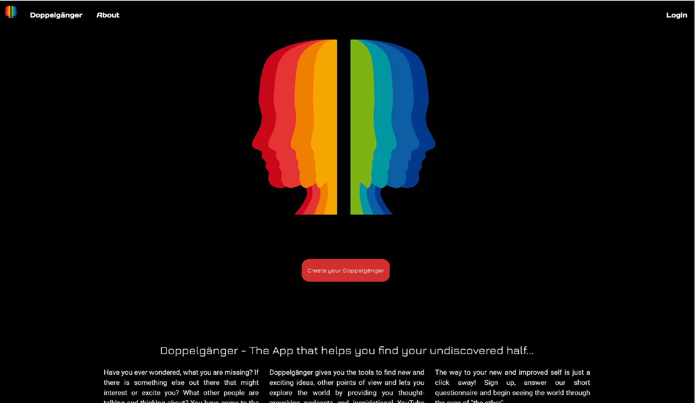
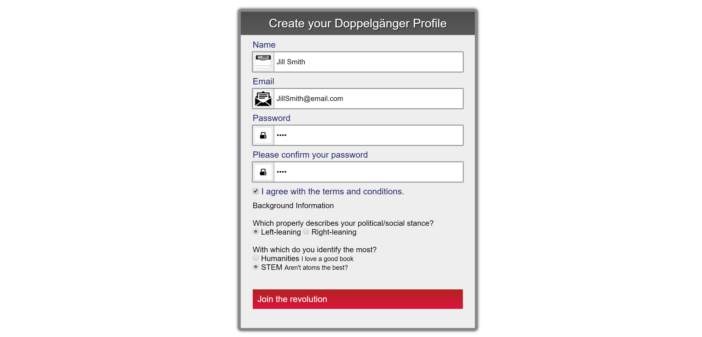

# Doppelganger
Doppelgänger allows users to create an account and specify two important pieces of information about themselves: their political leaning and their general background--either STEM or humanities. Once they log in, they are provided with resources in both areas that are geared toward the opposite types. Resources provided include: YouTube videos on various topics, Apple podcasts, news articles, and Google Books. 

The goal of the application is to broaden the user’s mind to other perspectives and allow them the opportunity to meet a different side of themselves and the world.

## How It Works
When a user lands on the homepage, he/she will sign up or log in. 

When the user makes a profile, he/she will select two important things about him/herself: political leaning and interest background.

## Developed Using
* JavaScript/jQuery
* Node.js
* MongoDB
* Passport.js
* YouTube and News APIs
* Socket.io
* Materialize

## Developed By
* Kristina Karrass
	* [Kristina's GitHub Repo](https://github.com/kristinakarrass)
* Brian Manchester
	* [Brian's GitHub Repo](https://github.com/bmanch)
* Seton Raynor
	* [Seton's GitHub Repo](https://github.com/setonr)
* Candace Toliver
	* [Candace's GitHub Repo](https://github.com/CToliver12)
